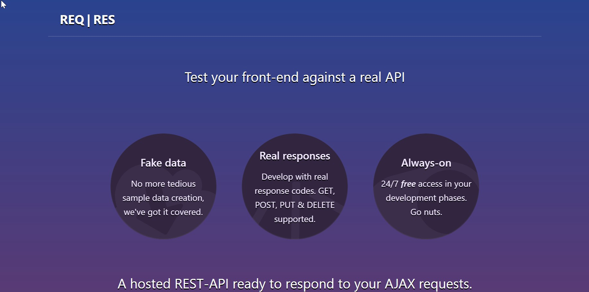
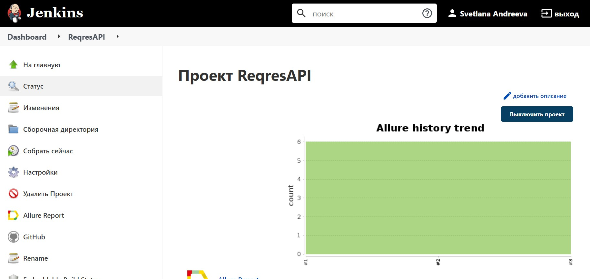
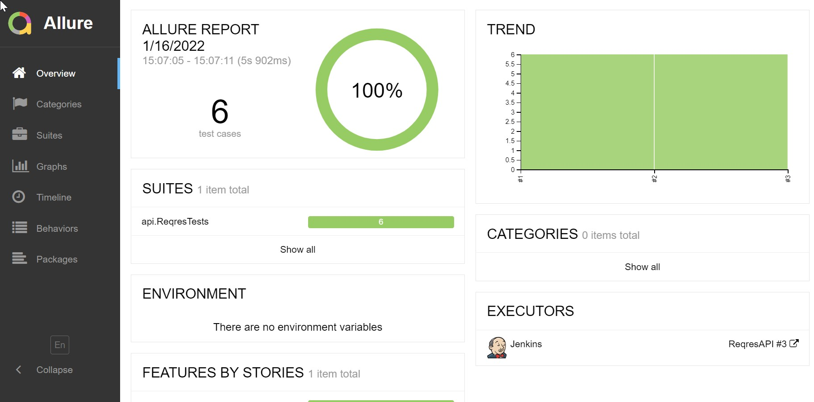
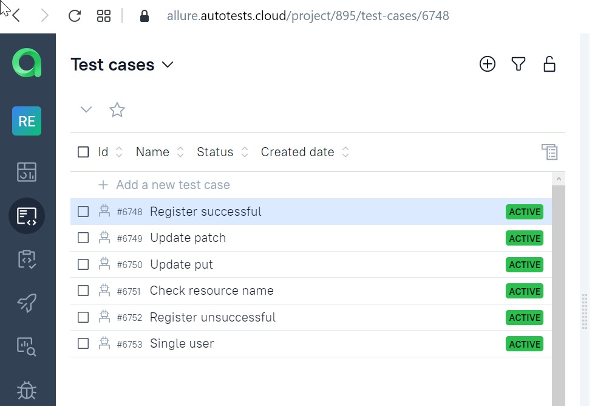
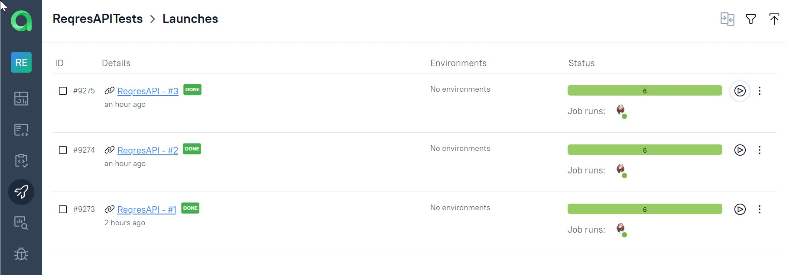
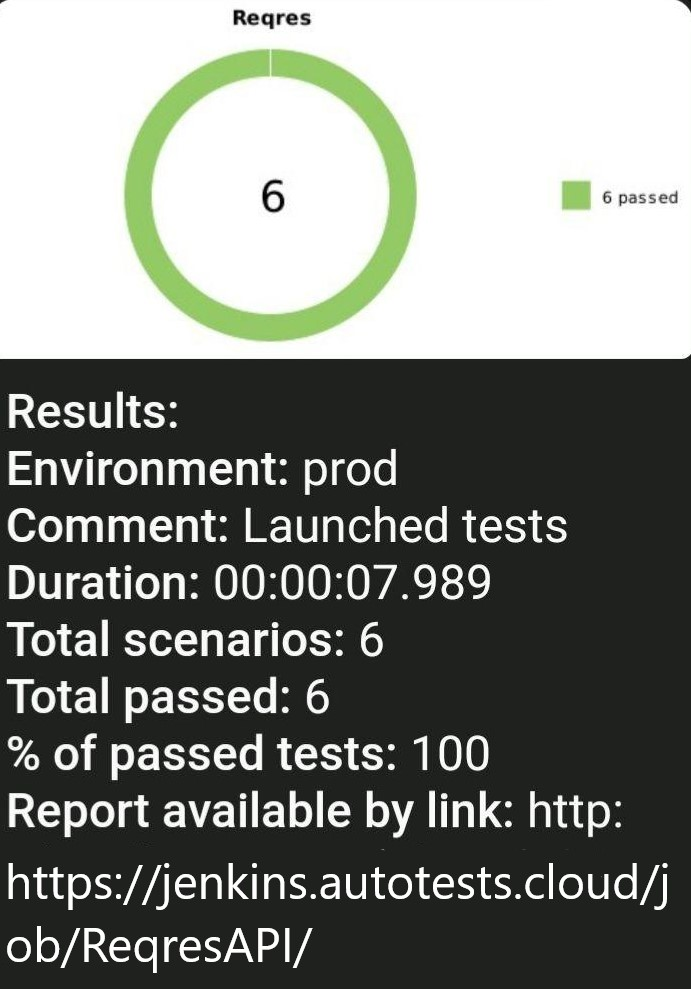

## Проект для https://reqres.in/



## Использованы технологии:
|  Java  | Gradle | Junit5 | Selenide | GitHub | Jenkins | Allure Report |   Jira   | Rest-Assured|
|:-------:|:-------:|:-------:|:-------:|:-------:|:-------:|:-------:|:-------:|:-------:|
|  |  |  |  |  |  |  |  |  |

___

## Запуск тестов происходит в CI [Jenkins](https://jenkins.autotests.cloud/job/ReqresAPI/)



Запуск тестов:
```bash
gradle clean test
```

Генерация отчета:
```bash
allure serve
```
```bash
build/allure-results
```
___

## Генерация отчета происходит в Allure Report



___
___

## Тестовая документация хранится в Allure TestOpts




___

## Уведомления о прохождение тестов отправляются в Telegram


___